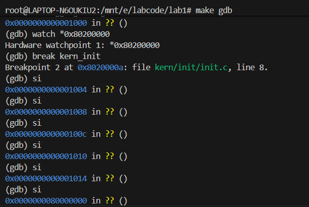
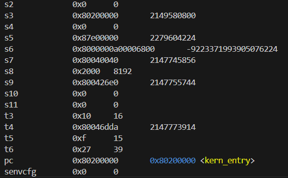
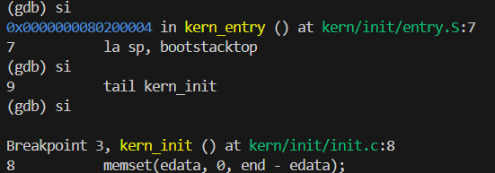
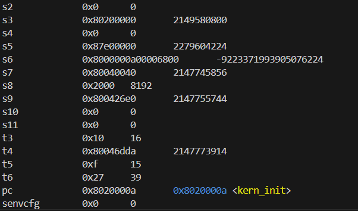
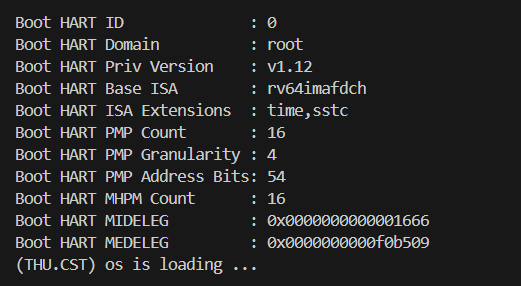

# lab1实验报告

## 练习1：理解内核启动中的程序入口操作

操作系统内核的生命周期始于计算机引导加载程序（Bootloader）将内核镜像加载到内存，并将控制权交给内核的入口点。在我们的实验项目中，这个入口点是 `kern_entry`，它位于汇编文件 `kern/init/entry.S` 中。`kern_entry` 的核心职责是为C语言代码的执行准备一个最小化的、有效的运行环境。这通常包括设置栈指针、清空 BSS 段等。完成这些底层设置后，它会将控制权转移给 C 语言编写的内核主函数 `kern_init`。

### 1.1`la sp, bootstacktop`

-   **指令操作**：
    `la` 是 "Load Address" 的缩写，是一条伪指令。`sp` 是栈指针寄存器（Stack Pointer）。`bootstacktop` 是在 `entry.S` 文件末尾定义的一个标签，它指向了为内核引导过程预留的栈空间的顶部。
    因此，`la sp, bootstacktop` 这条指令的作用是**将 `bootstacktop` 的内存地址加载到栈指针寄存器 `sp` 中**。

-   **目的**：
    这条指令的目的是**初始化内核的栈**。栈是现代程序运行不可或缺的部分，它用于：
    1.  **函数调用**：保存函数返回地址、传递参数。
    2.  **局部变量**：为函数内部的局部变量分配存储空间。

    在执行任何 C 函数之前，必须先建立一个合法的栈。`entry.S` 文件通过 `.space KSTACKSIZE` 分配了一块名为 `bootstack` 的内存区域作为内核的初始栈，而 `bootstacktop` 标签则位于这块内存的最高地址处。由于栈是向下增长的（从高地址向低地址），将 `sp` 指向栈的顶部就为即将执行的 C 函数 `kern_init` 准备好了可用的栈空间。

### 1.2 `tail kern_init`

-   **指令操作**：
    `tail` 是一条伪指令，它通常被汇编器翻译成一条无条件跳转指令（如 `j` 或 `jr`）。`kern_init` 是在 `kern/init/init.c` 中定义的 C 函数，是内核的主入口函数。
    因此，`tail kern_init` 这条指令的作用是**直接跳转到 `kern_init` 函数的起始地址去执行**。

-   **目的**：
    这条指令的目的是**将控制权从汇编引导代码转移到 C 语言内核代码**。在完成了最基本的硬件环境设置（如初始化栈）后，汇编代码的使命就已完成。后续更复杂的初始化任务，如清空 BSS 段、初始化物理内存、设置中断等，都交由功能更强大的 C 语言代码来处理。

    使用 `tail` 而不是 `call`（或 `jal`）指令有其特殊含义。`call` 会将下一条指令的地址（返回地址）压入栈中，以便函数返回后继续执行。但在这里，`kern_entry` 的任务已经彻底完成，我们**永远不希望**从 `kern_init` 返回到 `kern_entry`。`tail` 实现的是一次“尾调用”，它不会保存返回地址，仅仅是简单地“一去不回”的跳转。这既符合逻辑，也节省了一次压栈和未来出栈的操作，是一种简洁高效的控制权转移方式。

## 练习2: 使用GDB验证启动流程

本节记录了使用 GDB 调试工具跟踪 QEMU 模拟的 RISC-V 平台从加电到执行内核第一条指令的完整过程。

### 2.1 调试准备与过程

1.  **启动 QEMU for GDB 连接调试**：
    首先，我们需要让 QEMU 在启动后暂停，并监听 GDB 的连接。这可以通过在 `Makefile` 中指定的 `make debug` 命令实现。

    而在另一个终端中，我们通过 `Makefile` 中指定的 `make gdb` 启动 RISC-V 版本的 GDB，并连接到 QEMU。

2.  **设置断点并跟踪**：
    连接成功后，我们在内核的第一条指令地址 `0x80200000` 处设置一个断点，然后让程序继续执行。
    ```gdb
    (gdb) b *0x80200000
    Breakpoint 1 at 0x80200000
    (gdb) c
    Continuing.
    ```
    程序会停在我们在 `kern_entry` 设置的断点处，证明内核代码即将开始执行。

### 2.2 观察与分析加电后的指令


1.  **初始状态**：
    为了探究加电后真正执行的第一条指令，我们需要在 GDB 连接后，不设置断点，而是直接使用 `si` (Step Instruction) 命令进行单步调试。

    
    
    当 GDB 首次连接到 QEMU 时，可以看到终端中显示`0x0000000000001000 in ?? ()`。

    这表明，**RISC-V 硬件加电后，执行的第一条指令位于地址 `0x1000`**。    

2.  **`0x1000` 地址处的代码**：
    这个地址位于 QEMU 的固化引导 ROM (Boot ROM) 中。此处的代码是 QEMU 模拟的硬件固件，是真正的“第一阶段引导程序”。它的功能非常基础，主要完成以下工作：
    -   **设置设备树 (Device Tree Blob, DTB)**：它会找到 DTB 的位置，并将其地址放入 `a1` 寄存器中，以便后续的引导加载程序或内核能够了解当前的硬件布局。
    -   **跳转到下一阶段加载程序**：它会跳转到一个固定的内存地址，通常是 `0x80000000`。这个地址上存放的是第二阶段的引导加载程序，在我们的实验环境中通常是 **OpenSBI**。

3.  **OpenSBI 的角色**：
    代码执行权跳转到 `0x80000000` 后，OpenSBI 开始执行。OpenSBI (Open Supervisor Binary Interface) 是一个开源项目，它为运行在 M-Mode（机器模式）下的操作系统内核提供了一个标准的接口，使得内核可以请求底层硬件的服务（如操作定时器、发送核间中断等）。
    OpenSBI 完成了更复杂的初始化，包括：
    -   初始化 M-Mode 下的中断和异常处理。
    -   设置 S-Mode的运行环境。
    -   最后，它会跳转到操作系统内核的入口点，也就是我们指定的 `0x80200000`。
    
    通过 `info registers` 命令可以查看到程序计数器 `pc` 以及其他寄存器的值。
    
    

4.  **kern_entry 的角色**:
    代码执行权跳转到 `0x80000000` 后,kern_entry开始执行，kern_entry是操作系统内核的入口。它的作用是设置内核栈指针，为C语言函数调用分配栈空间，准备C语言运行环境，然后按照RISC-V的调用约定跳转到kern_init()函数。

    在kern_init()函数处设置断点并使用 `si` 命令进行单步调试查看汇编代码。
    
    
    同样在断点处通过 `info registers` 命令可以查看到寄存器的值。

    

4.  **kern_init 的角色**:
    最后，kern_init()调用cprintf()输出一行信息，表示内核启动成功。
    
    

### 2.3 结论

通过 GDB 调试，我们可以清晰地梳理出从加电到内核启动的完整链条：

1.  **硬件加电**：CPU 从复位向量地址 `0x1000` 开始执行。
2.  **Boot ROM (地址 `0x1000`)**：执行 QEMU 的固件代码，进行最基础的硬件探测，并准备好 DTB 指针。
3.  **跳转到 OpenSBI**：Boot ROM 将控制权转移到位于 `0x80000000` 的 OpenSBI。
4.  **OpenSBI 初始化**：OpenSBI 为内核准备好监管者模式（S-Mode）的运行环境。
5.  **跳转到内核**：OpenSBI 将控制权最终交给位于 `0x80200000` 的操作系统内核入口 `kern_entry`。

至此，硬件和固件的引导任务完成，操作系统的生命周期正式开始。

## 总结
本次实验通过代码分析和 GDB 调试，完整地再现了操作系统内核从加电到执行第一行 C 代码的完整启动链条。OpenSBI 的存在，定义了一套标准的二进制接口 (SBI)。内核通过这个接口向 M-Mode 的固件请求服务，而无需关心底层硬件的具体实现。同时GDB 调试揭示了从 0x1000 (Boot ROM) 到 0x80000000 (OpenSBI)，再到 0x80200000 (Kernel) 的跳转过程。这体现了操作系统设计中重要的分层思想，这种特权级分离是现代操作系统安全模型的基石，它将内核与底层固件隔离，保护了硬件，也为内核提供了一个稳定的运行环境。